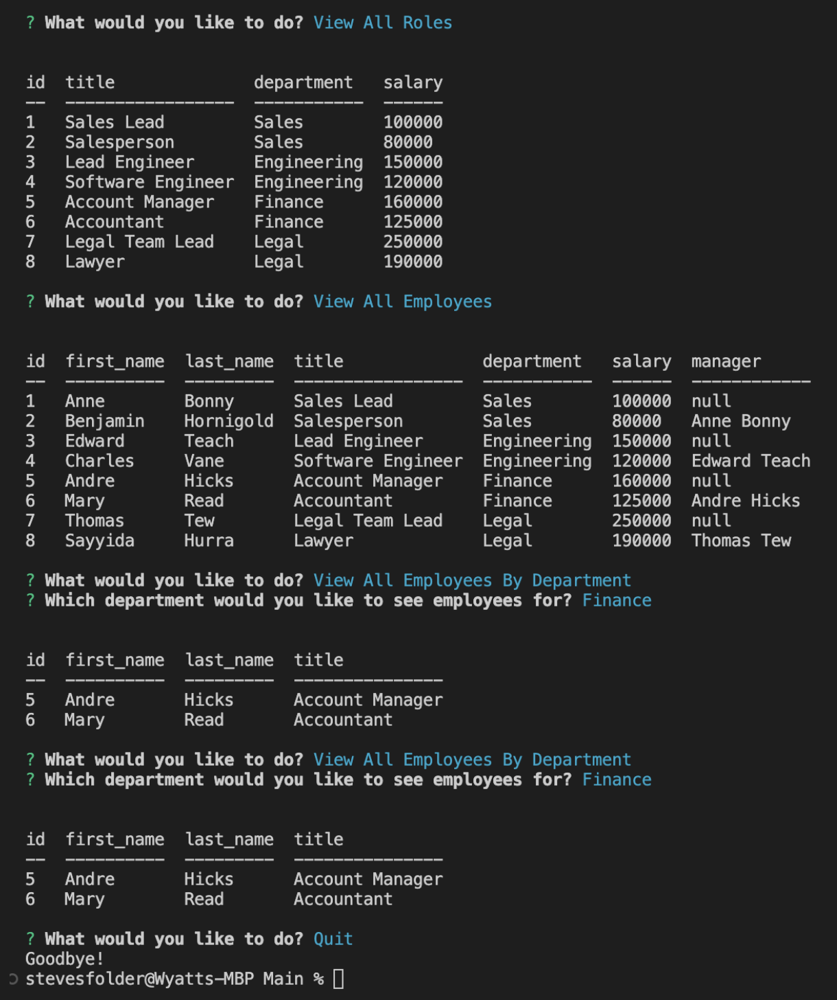

# Employee-CMS

## Description

This is a command-line application built with Node.js, Inquirer, and MySQL, designed to manage a company's employee database. The app allows non-developers to easily view and interact with information stored in a database, making it a useful content management system (CMS) for businesses.

The Employee Tracker app is a developer's solution to creating a user-friendly interface for database management. It enables users to view, add, update, and delete data in the company's employee database, including information on employees, departments, roles, and salaries.

The app was built from scratch, leveraging the power of Node.js, a popular server-side programming language, and MySQL, a popular relational database management system (RDBMS). The user interface was designed using Inquirer, a powerful command-line interface library that provides a simple and intuitive interface for users.

To use the app, users will need to have Node.js and MySQL installed on their machines. The Employee Tracker app is easy to use and has a simple user interface, making it a great tool for businesses of all sizes.

## Table of Contents 

- [Installation](#installation)
- [Usage](#usage)
- [Credits](#credits)
- [License](#license)

## Installation

Download or clone the repository. Enter `npm i` into the command line to install dependencies.

## Usage

When Prompted use the arrow keys to highlite your choice and then press enter to select your choice.

## Credits

- https://shields.io/category/build
- https://www.npmjs.com/package/inquirer

## License

This project uses the MIT license.
(see LICENSE file for details)

---

## How to Contribute

Fork repository or Create a Pull request
